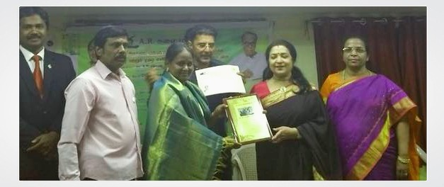
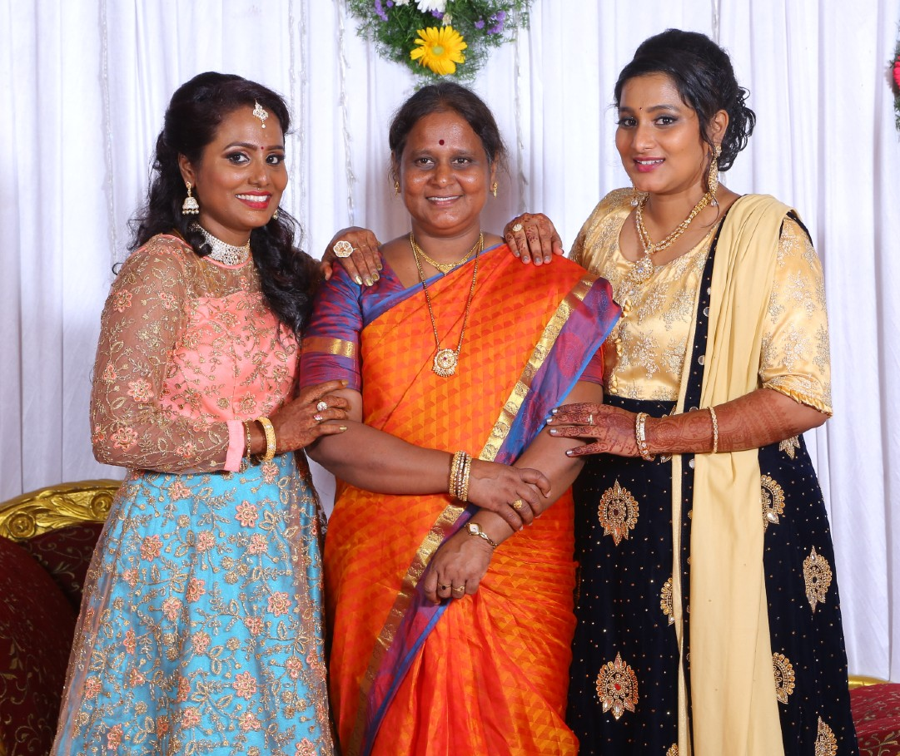

Dear Mom,

I have stepped into my 30th year. Like every other birthday, I just wanted to go through my past life but this time it’s not about me. I thought of looking for people who have participated more in my life and been there for me all the time. Guess what, it was you! It's not a surprise for me though.

At this moment I wanted to thank you mom for all sacrifices that you have done for me. You always wanted me to be strong and courageous because of the struggles you’ve been through. That moment I just thought why my mom isn’t curdling or pampering like other moms, instead of appreciating your courage towards life. I’m sorry mom.

You’re a perfect teacher both in the profession and in your personal life. I have seen all your students loving you so much and see, how you have brought up your daughters, as a kind-hearted person with high morality. I have always admired you as a teacher more than a mother. The care and effort for your students. Maybe that’s why I am a trainer now?

A few years back, once I was walking down the street, a young man just stopped me and was so excited to see me as I was recollecting his face from my memory. He was my student in the year 2009, and he still remembers me. It's great news, isn’t it? Not only him, but there are also many students who still in contact and never forget to wish me on teacher’s day as I wish you. That’s one moment I see more ‘you’ in me.

I should say this. Thank you, mom, for supporting me about my marriage. I know how big a deal that was, to manage all the relatives who were creating troubles because of the ‘good for nothing caste issue’. Though you had all sorts of hurdles, finally you helped me marry the guy I love. Thank you, mom, for believing me in all my decisions.

One thing I loved to tease you about is your cooking. I can feel you laughing right now after reading this. You used to run like the ‘Flash’ and ‘Datan!’ food is ready. No compromise on taste, it would always turn to be good and eatable. Hilarious! I just used to tease you for being super-fast and for not being calm and composed. But mom, I miss your cooking now; especially the ‘Briyani’.

I wonder how you managed to be a patient wife, great mom, loveable teacher, tolerant nanny and so many, ahh! I’m scared and nervous and not if I will be able to bring up my child as you did.