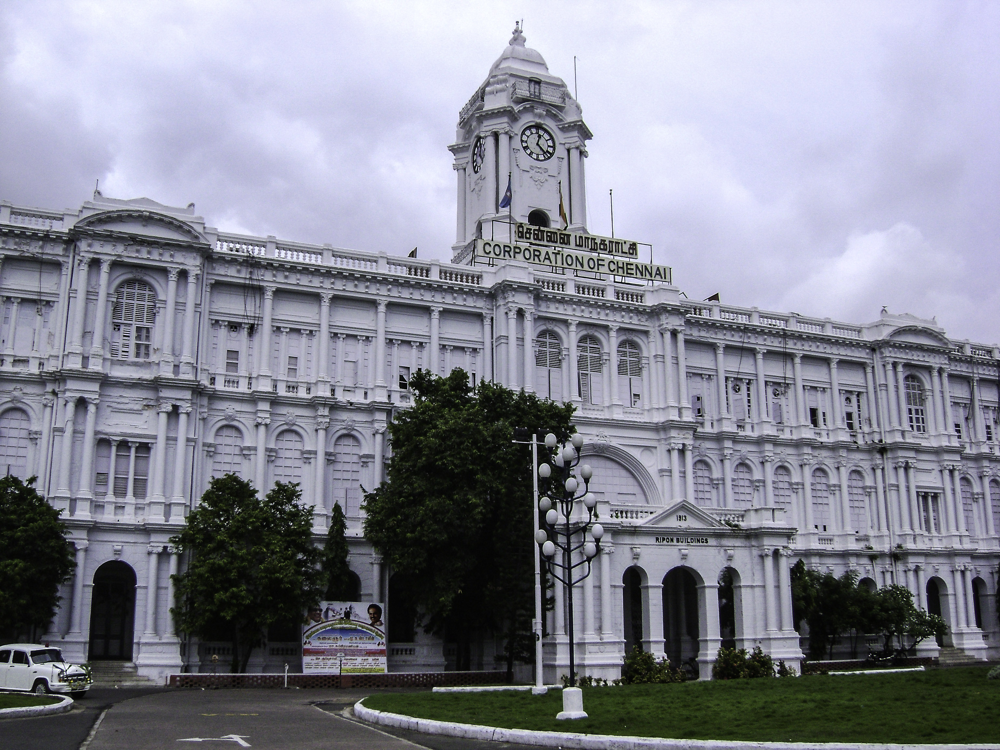
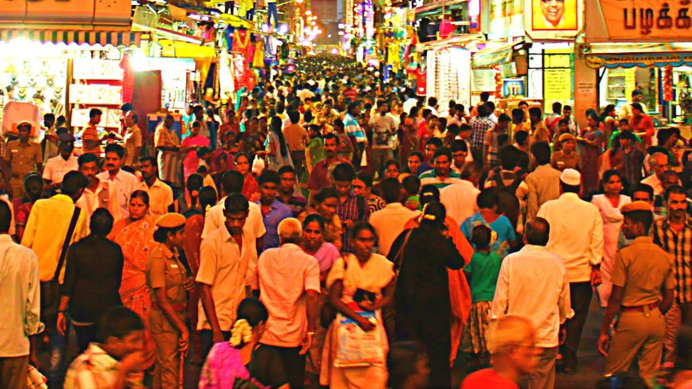

Chennai is the city where I was born and brought. It’s a metropolitan city at the state named Tamil Nadu in India. I simply love my city and that’s when I learned about unconditional love. I have roamed almost all the streets having an emotional bond.

It’s a coastal landscape and has so many beautiful beaches. The worlds second longest beach ‘Marina’ is also located in Chennai. But my favorite is the ‘Thiruvanmiyur’ beach. I usually go there to admire the beauty of the sunrise. There is a stone bench alongside the pedestrian path which I love for no reason.

The other factor I love about my city is the street food and the night restaurants. You get amazing food at an unbelievably cheap cost anywhere in the city. You really need not search for one. For two streets we can find at least one street food vendor. There are night restaurants to support people who work during late hours and available in all cuisines.

The most important and sentimental factor I like about my city is the diversity in there. I have seen people from almost all around the world either working or travelling. My city gives your various opportunities for all aspects you need. People come in for medical purposes, to procure a job, for sightseeing, to live in or settle down. Have also seen foreigners who had come just to do some shopping. All people live in harmony and peace despite all other differences. I feel proud of being born at Chennai and I miss it a lot. 

I would categorize shopping into two

- The real shopping
- The window shopping

If its window shopping, just to chill and hangout with friends, then definitely its those gigantic malls located all over the city. If its real shopping I can list few places. They are real quest and worth spending your entire day.

- Spencer Plaza – On the old mall in Chennai. I love shopping all types of apparels except part wears here. They are cheap and worth for the cost you spend. I also love the lemonade here. Amazing, thirst quenching and a best relaxation after shopping for 10/- (3 years back). 

- Parrys Corner, Rich street – as the name goes, people own a shop here is definitely ‘rich’. The shop owners are usually tech guys who does not have a certification. Yeah, you get all types of electronic goods here. You can also approach them for service & repairs. Watch out friends, everything has its own dark side. Just check for the authenticity of the products.

- Beach station – this is exactly my favorite category, Food! Almost 3 to 4 streets opposite to the beach sub urban railway station, you can find amazing tasty mouthwatering middle eastern foods, especially Kabbab’s and Falooda’s. you must walk a lot and explore for your favorite shop.

- T.Nagar Ranganathan street & Washermenpet – famous places for shopping apparels. I also shop party wear here. You get casual frock/ dress for just 300/- from the street vendors by the sides of the bridge. Its them who add a festive effect to the entire location. You can spend solid two days to cover at least 80% of the shop. Not just apparels, we also have exclusive jewelry showrooms.  

- IMAX and Palazo – the IMAX theaters at the phoenix mall and the Palazo at Forum mall are the famous and trending theaters.  They 9 screens and excellent sound. The construction and atmosphere are lovely. The PVR cinemas at the VR mall are the upcoming theaters, trying hard in the race.
The Queens land – the best amusement park with both dry and wet rides. The Himalayan ride is my favorite one. There were times where this become a frequently suggested hangout spot.

- Mudaliarkuppam Boat House – the beautiful and a peaceful spot I have ever gone near a city. Its located on the East Coast Road, 92 kms away from Chennai city towards Pondicherry. You can travel to a nearby island by choosing motor or Row boats. This island connects Odiyur lake back waters and the beach water from The Bay of Bengal. The fisherman living nearby visit and sell tender coconuts in the island. Otherwise theres no habilitation in the tiny peace of land. You will enjoy a calm, pleasant blissful moment.

Do you now get it? Why do I miss my city so much? Yes. So, friends, if you happen to travel to Chennai (my paradise) don’t hesitate to ping me for more adventure and exciting memorable experiences. 
