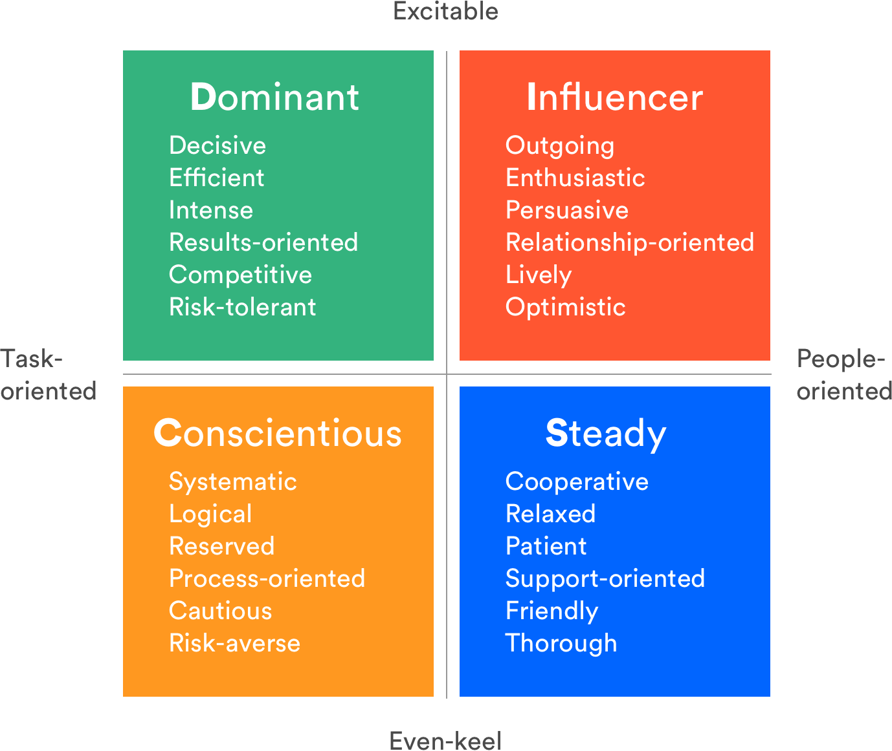

The first rule in NLP (Neuro Linguistic Programming) is ‘You cannot not communicate’, which means you can never stay without communicating to others to survive.
There are different types of communication. The most famous classification is the verbal and the nonverbal communication. Similarly, we also have different communication style.

Understanding different communication styles and paying attention to which styles our teammates gravitate toward, can improve our interpersonal skills, build trust, and help us get more done with less frustration.

Understanding our differences – especially in the way we communicate – is actually an investment. The payoff is Stronger workplace relationships, which is a major predictor of employee engagement, stress less work environment and therefore, certainly productivity. 

### Communication styles are influenced by behavior traits

When figuring out how you can communicate effectively with someone, it’s important to understand their broader personal style. Are they direct? Analytical? Sociable? Business-like? Behavioral traits clue us into how people respond to information, which, in turn, helps us anticipate how to converse in a way that strengthens the relationship.
Here is a model by AUBREY BLANCHE, Global Head of Diversity & Belonging.

### My Style

If your curious to know my communication style, guess

#### Initiating 

This style is sociable, enthusiastic, energetic, spontaneous, and fun-loving. Often perceived as self-assured, innovative, and persuasive. Likes to feel accepted and is motivated by relationships. responds strongly to praise and approval. pace is fast and he may appear impulsive at times. prefers a stimulating, personal, and friendly work environment.

#### Use of other styles
No human cling to just one personality. It depends on the hour of need and the dominant style. Similarly, you can't stick with one communication style. Knowing all style and the right way to use it will develop interpersonal communication at workplace.
- Direct/Dominant Communicators  
These communicators prefer when you get to the point directly, quickly and in a succinct manner. When dealing with these communicators, be specific and avoid over-explaining or repeating yourself. Focus on solution and talk only when asked for. They are also called Doer’s.
- Initiating/Influencer communicators  
Initiating communicators value interacting with others and sharing stories. Allow time for socializing at the beginning of meetings and create a friendly environment. We have to provide time for them to express their feelings and emotions.
- Supportive/Steady communicators  
Supportive Communicators appreciates a calm and steady approach. Earn their trust by providing them with plenty of reassurance. When seeking their opinions and ideas, encourage them to express their concerns and allow them time to make decisions. 
- Analytical/Conscientious communicators  
Analytical people like facts and figures. Present information to them in an organized manner and be prepared to answer their questions. Be patient while they think through and process new ideas.

So, with this knowledge, by changing our words we could change the world to a better place for a better relationship, being it personal or professional.

