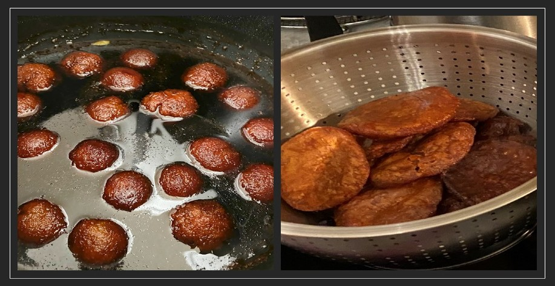
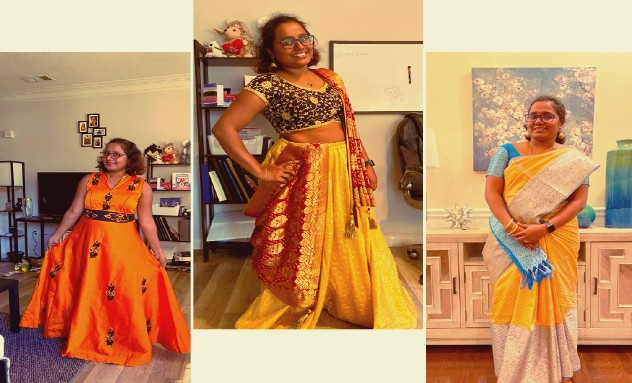
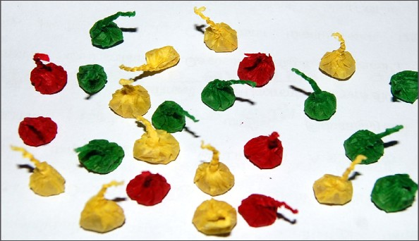

Diwali is called the festival of lights. Evil is dead therefore we celebrate with lights. We have lots of mythological stories. Besides these stories, what we do during this festival is our story and that’s what I’ll be sharing with you today. This Diwali is special as this is my first Diwali in the US.

Sweets or desserts are so important for any festival we have different kinds of desserts for Each festival. The one on the right is ‘Adhirasam’ made from rice flour and jaggery. The one on the left is ‘Jamun’ made from flour and sugar syrup. These were the two desserts I prepared for the first time in my life. Mommy’s from every household will start this preparation of desserts two days before Diwali, as most of the Indian desserts are long and complicated process.

The next is the new dress for the festival I got three dresses. The first from left is my sister’s gift, then my hubby’s gift, that saree was my mom’s gift.

Usually, our day starts with a head shower, where you soak your scalp with gingelly oil which reduces your body’s temperature and lets your body stay cool. Then dress up and photoshoot just like this

Fireworks!!! Without these Diwali is incomplete, I'm just the spectator usually, this time my hubby helped me encounter some adventure. Otherwise, my favorite is the Sparklers. This is called ‘Vengaya vedi’ or pops. 

You need not lit it, just got to throw towards a ground surface. I was using this to play pranks with my friends as they walk, I was throwing it near them. It doesn’t emit any light sparks so it’s safe just the sound. It was fun.

For every couple, those who are newly married the first Diwali is very special called Thala Diwali. They will receive lots of gifts and food. It's celebrated in the bride's place. Last year was our Thala Diwali, Unfortunately, we were at different places and couldn’t celebrate together. So technically this Diwali is our first Diwali together. We had a great time love happiness and togetherness. It was impeccable.

Finally, the most important aspect is diversity. You need not be a Hindu to celebrate Diwali, we never say it’s a Hindu’s festival. It’s called the festival of lights. Whatever religion you belong to a little love and happiness enjoying with your friends with fireworks will do the magic. 

Not only Diwali, any festival for that matter, I always love decorating Christmas trees with my friends and I do it every year when I was in India. Festivals are always meant to share love and happiness. With that said, wish you all a ‘Happy Diwali’, May light shine in your life.