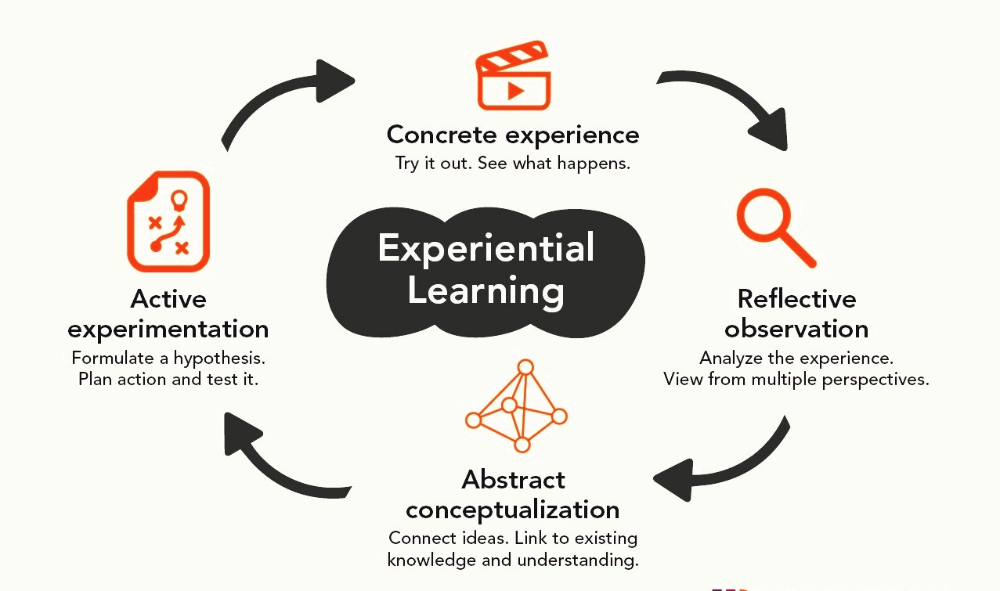

>  #### “The best teachers are those who show you where to look, but don’t tell you what to see”

The biggest challenge any teacher faces is capturing the students’ attention and putting across ideas in such a way that it stays with them long after they have left the classroom. For this to happen, the learning experience should be redefined and made more innovative.

### Experiential learning

Experiential learning is the process more specifically defined as "learning through reflection on doing". Experiential learning is distinct from didactic learning, in which the learner plays a comparatively passive role. 

The general concept of learning through experience is ancient. Around 350 BCE, Aristotle wrote in the Nichomachean Ethics "for the things we have to learn before we can do them, we learn by doing them". Experiential learning has significant teaching advantages. 

> #### “Experiential learning is personal and effective in nature, influencing both feelings and emotions as well as enhancing knowledge and skills.”

Experiential learning engages learners in critical thinking, problem-solving, and decision making in contexts that are personally relevant to them. This approach to learning also involves making opportunities for debriefing and consolidation of ideas and skills through feedback, reflection, and the application of the ideas and skills to new situations. The crux of the learning occurs during the reflective process where learners assess their decisions in the light of natural consequences, mistakes, and successes.

The idea of experiential learning as a cycle was suggested by prominent educationalists such as Jean Piaget, John Dewey, and David Kolb.

The experiential learning cycle involves four phases:

- **Experience:** Engaging in an experience in a particular situation and then observing its effects.
- **Processing the experience:** Understanding what we did, thought and felt during the experience.
- **Generalising:** Understanding the general principle (called a ‘generalisation’) behind the relationship between the action and its effects.
- **Applying:** Applying the principle or generalisation to a new situation.

Reflection is the key to learning from experience because it consciously focuses our attention on what we have learned and thus consolidates it. Reflection is part of the debriefing process. Debriefing helps the learners process the information and make generalizations from their experiences and apply what they have learned in new situations.

The learning should be personally meaningful and have some significance to the learners. They will have opportunities to reflect on and discuss their learning experience throughout the process. The experience will involve the student's whole person, including the senses, personality, and emotion. The knowledge on the subject matter gained will be acknowledged for which experiential learning is important.