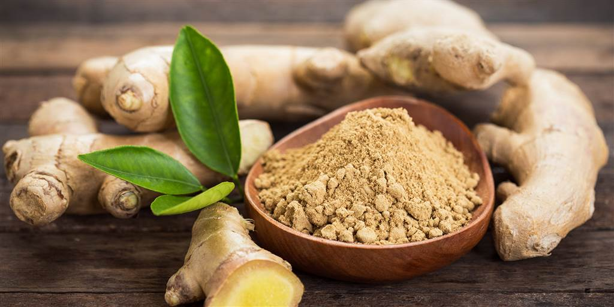

**Food ingredients and their medicinal benefits**

I have been indulged in research on how food ingredients serve as medicines based on my experience and prepared to present it to you all. Let’s explore ginger and its medicinal benefits.

People have used ginger in cooking and medicine since ancient times. It is a popular home remedy for nausea, stomach pain, and other health issues.

I still remember my aunt forcefully feeding me concentrated ginger extract to clear my wheezing trouble. I hated her then, but later realized it was her home remedies that made my wheezing trouble vanish at 14 itself. But it did not trouble again me until now.

The Indian tea, also known as chai, is a very famous preferred refreshment than coffee. Among different varieties of chai, the ginger-flavored chai is amazingly refreshing. Indeed, helpful.

**Benefits**

Ginger may have anti-inflammatory, antibacterial, antiviral, and other healthful properties. Following are some medicinal uses of ginger.

- Reducing gas and improving digestion
Ginger helps in reducing gas and improving digestion. Ginger also appears to have beneficial effects on the enzymes: trypsin and pancreatic lipase, which are important for digestion.
Relieving nausea

- Relieving nausea
Some research shows that ginger can help ease morning sickness and relieve nausea following cancer treatment.

- Easing a cold or the flu
Many people use ginger to help recover from a cold or the flu. Fresh ginger may help protect the respiratory system, while dried ginger did not have the same impact.

- Relieving pain
Researchers behind a small study, which included 74 volunteers, found that a daily dosage of 2 grams (g) of raw or heated ginger reduced exercise-induced muscle pain by about 25%.

- Supporting cardiovascular health
There is some evidence that ginger extract may help with cardiovascular disease. One review found that a dosage of 5 g or more can cause significant, beneficial anti-platelet activity.

- Lowering cancer risk
Ginger does not provide protein or other nutrients, but it is an excellent source of antioxidants. Studies have shown that, for this reason, ginger can reduce various types of oxidative stress.
Oxidative stress happens when too many free radicals build up in the body. Free radicals are toxic substances produced by metabolism and other factors. The body needs to eliminate free radicals to prevent them from causing cellular damage that can lead to a range of diseases, including cancer. Dietary antioxidants help the body get rid of free radicals.

**Takeaway**

Some research shows that ginger may improve digestive health, reduce inflammation, and relieve pain, among other benefits.
However, often using high dosages of extracts — a person may not experience positive health effects from simply adding ginger to their diet.

Too much of anything is good for nothing.
  - Get to know the benefits.
  - Understand the cause.
  - Treat with precautions!

[My sources of study](https://www.medicalnewstoday.com/articles/265990#takeaway)

