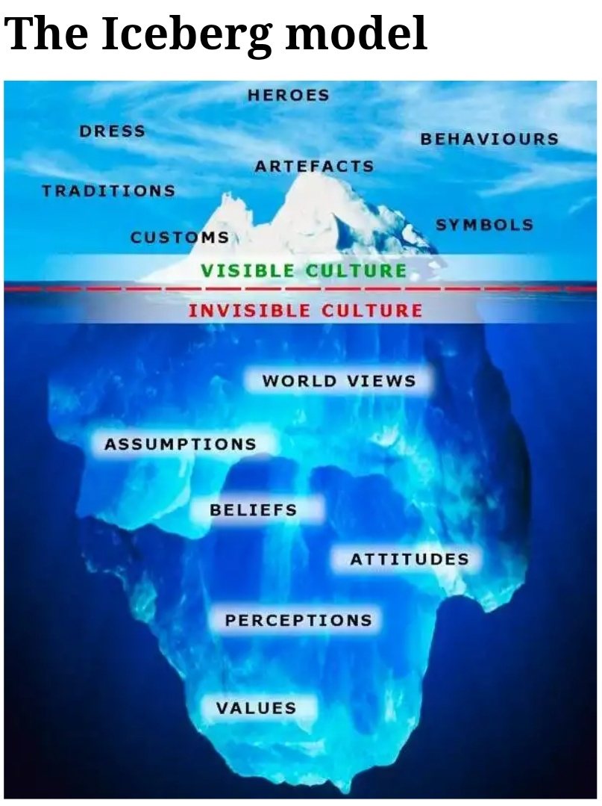
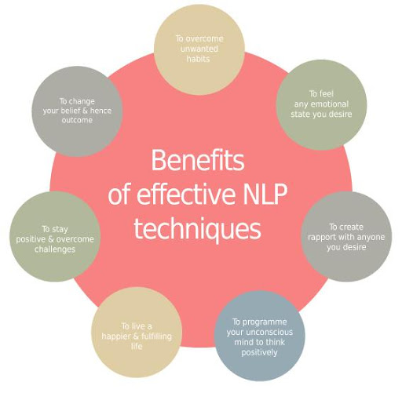
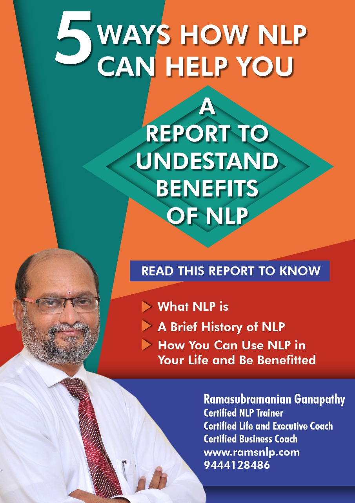

Today I would like to share a few things about NLP, like what it is? How does it work? The benefits. So just saying, “Hello to NLP”.

NLP is Neuro-Linguistics Programming language is an attitude, which can be used as a technique to derive the desired outcome or behavior from a given human belief system.

- Neuro – Thoughts
- Linguistics – Language
- Program – the way you get the desired outcome behavior, communicating with thoughts.

NLP was found by Richard Bandler and John Grinder in 1970, California.

### How NLP helps

NLP as a technique can help you in whatever profession you are in., you’re a salesman or a coach or a leader, you can certainly become a better or even best if you are already better.

I would endorse NLP to be a grooming session because it gives you a completely different perspective of life. In simple words, it helps you to view all the situations, in and around you, with all different perspectives with different dimensional aspects to it.

The ‘me’ before undergoing NLP certification is a completely different person to what I am today. It makes you more self-aware, enhances your EQ – emotional quotient. The ability to know and control your emotions, therefore the action that follows.

### How NLP works

It depends on the ICEBERG model. 

It’s between the conscious and unconscious mind, between behavior and values, belief, together called the belief system. Few are okay with smoking, few aren’t okay with it, for few it’s a great sin. So no of them are right are wrong. It all depends on whether your actions are useful or not.

How does one action have different opinions? That’s based on our belief system. It can be built both externally with family, culture, tradition, or internally with your own experience.

### Benefits of NLP

- It helps to cure phobias, depression, anxiety, and get rid of unwanted habits.
- It also helps you in effective communication and rapport building.
- Hence, NLP helps you to be positive and successful in life.

One technique that impressed me and used quite often by almost everyone is anchoring.

### Anchoring

You anchor someone, something, or some emotion to others. It helps with the emotional quotient and the activities following.

So how many of you have tasted biryani....? This is what I do. 

- When I am stressed at work, I order biryani. So here I anchor some emotion to a food.
- When I am depressed, I listen to my playlist
- When I am dressed black, I feel confident

This action of anchoring we all do in our daily life.

This will help you in knowing your emotion, controlling it and channelizing it to a positive behavioral outcome, which isn't an easy task.

> 'Fine-tuning our habits to a positive outcome, we may have a great behavioral change and a positive image of our self'.

I am a NLP master practitioner and I did my certification with [Life academy, Chennai](https://www.lifeacademy.co.in/). My coach Mr. Ram sir was an extraordinary person with abundant skill and knowledge. A three level training program with people from different areas of expertise - it was an amazing experience. we had fun at learning.

