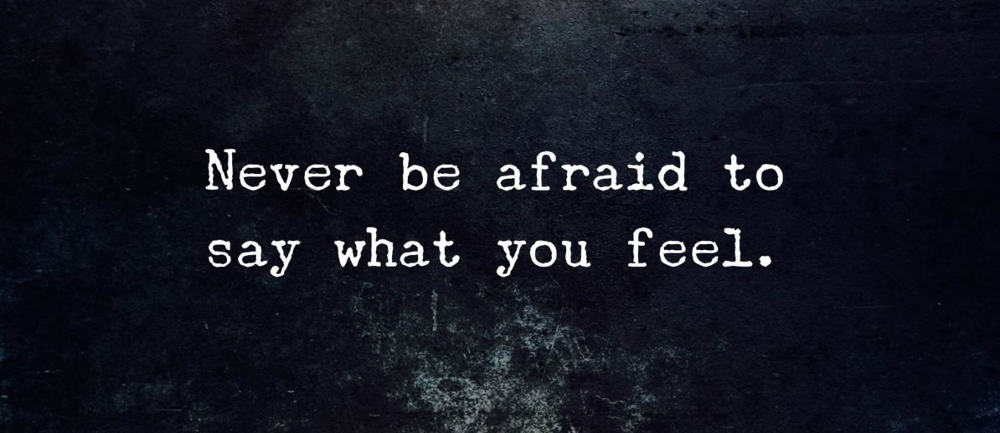

**It’s okay;** what does it mean?

Have you ever realized that ‘Okay’ has been used with different meanings at different scenarios; also, it’s one of the most used word?

Yes, Okay/Ok is an informal word which has lots of meanings. ‘Okay’ also plays different roles like being a question, exclamation, verb, noun, adverb, and adjective. 

It’s used to express assent, agreement, or acceptance, to express satisfactory but not exceptionally or especially good. Also, used to express an authorization or approval.

Out of these, do you know which ‘okay’ I’m going to share with you today? you get to know by this story.

This is what happened, one day when I was posting a blog of mine, I asked my husband to review or say I asked him to read. My idea was that ill have another set of eyes to review my blogs before posting it. He replied me “I’m fine with technical work but not with the literature side of it”. I wondered why he is complicating, and I just wanted him to read. 

I was so upset that I couldn’t take the thought away from my head. That evening I was whining around and started the same talk again. This time maybe I communicated precisely. I said, “all I wanted is another pair of eyes to review before me posting it, and that’s why I asked you to read”. 

He said “it’s okay” in a motive to convince me. This time he failed to communicate appropriately so I picked it from there. “no, its not okay” I cried. Poor fellow the whole day he struggled a lot to convince and compromise me just because of ‘it’s okay’.

A week passed, I am part of MacToast Toastmasters club, an energetic and empowering platform where I nurture and build up my public speaking skills, leadership skills and my communication skills.

That fine week I was supposed to give a speech and I did all the preparation. Unfortunately, I forgot a point from my script. Snice I did a dedicated preparation I just comprehended the script and completed my speech successfully. 

I was just sharing this with my husband and said, “I forgot that point from my script”. He immediately replied, “it’s okay”. After two minutes of silence he continued “No, its okay is not okay. I’m sorry”. I broke into laughter and thought how a word could just terrify a man so much. 

Maybe its not the word that terrified him so much, it’s his intuitive wife.

