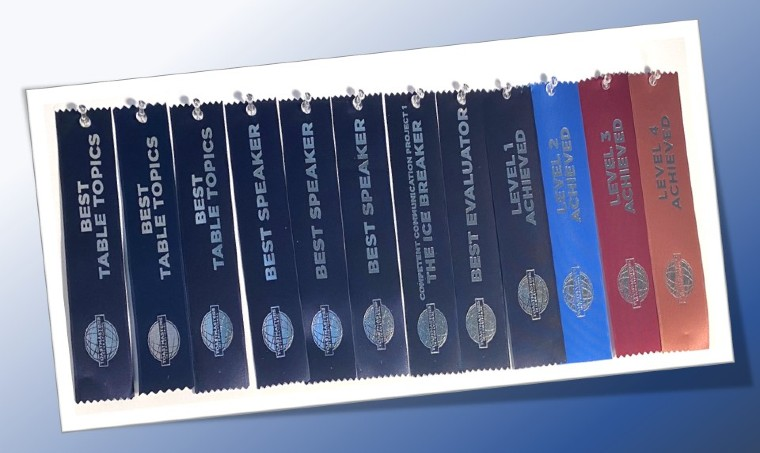
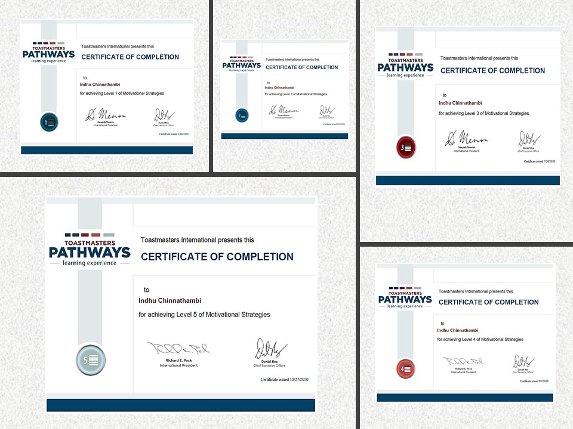

I’m Indhu from India, relocated to Atlanta, the US by November 2019. I was very much bored being at home all day being idle. As always, my brilliant hubby came up with a wonderful suggestion to find something that I’m interested in and the group relevant to my interest from the ‘meetup’ mobile application. 

That’s how my toastmasters journey started. I joined [MacToast](https://1274.toastmastersclubs.org/agenda.html?21whBY) toastmasters in January 2020. This journey is one exciting thing that happened, that I attempted and succeeded in ongoing success.

You might now wonder; I haven’t even participated in any contest conducted by toastmasters international. Then how could I say that I succeeded? According to me, you learn something new, and that learning turns into a captivating story that can be added to your journal then its success, your day was successful. 

The most impressive thing for me with toastmasters as an organization that focuses on an individual's self-development is the Pathways. The 5 levels and the course material to each level are amazing curricula built.

- Starting with an icebreaker, level 1, it helped me to investigate and analyze myself. This chance kindled beautiful memories and all positive attributes from the past 29 years of my life 
- Level 2, I learned to receive and give constructive feedback also to research on any topic and to share the crux of my research to the audience.
- From level 3, I was able to focus on communication styles, listening skills, presentation skills, storytelling and upgraded the same. 
- Level 4 and level 5 was a step ahead and I was able to attempt to, attain, and accomplish few things that I've never done before, but took this opportunity to prove myself. Things like organizing a project with a team, writing blogs, conducting online meetings, and online events. 
As a result, I'm an active blogger and an event host now.

I am also proud of choosing electives that weren’t chosen or performed earlier within our club. Several other electives are still a challenge for me that I will be attempting in my upcoming pathways like creating a podcast and moderating a panel discussion.

I am thankful to everyone who has been there for me on this journey. A special thanks and lots of love to my husband who always care about my interest and supports me in my personal development. He is the sole reason for me to initiate this journey.

I always have a liking for people's love, rewards, recognition, and wanted to be in the limelight. I am going to use this opportunity to fulfill this wish of mine by participating in all the contests that will be conducted next year and in the future. 5 years down the line I would like to see myself as the world champion of public speaking like Aron, Manoj Vasudevan, and Dhanajaya my inspiration.
