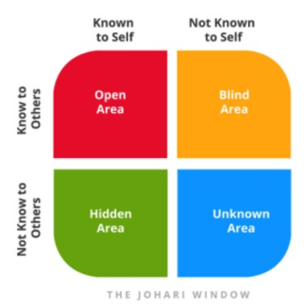

Team building is a process of turning a group of individual employees into a cohesive team. A team is a group of individuals with different styles and different personalities working together for a common goal or an objective.

Working together effectively requires collaboration within them. Doing so, the resulting bond will enable them to accomplish the work or goal more successfully than the non-bonded group.

What makes a group a team? Knowing each other as persons, not just professionals.

For which you must

-	Initiate conversations, as it strengthens,
-	Lend ears to their stories by listening more
-	Most importantly, empathize
-	Try being helpful at need in any possible way

Here a trustful bond is created.

I would like to explain a tool which helps in building trust and personal development. It was developed by Joseph Luft and Haringam after their names the tool was called JOHARI window.

There are four main areas in this window representing the information of individuals. Let’s discuss my **Johari window**.

There are four main areas in this window representing the information of individuals. Let’s discuss my Johari window.

The **Open Area** has information that I know about me, the same is also known to people around me.
-	Ex: I’m from India, I worked as an L&D professional.

The **Blind Area** or the shadow area represents information that I don’t know but people around me do. This could be information that I haven’t realized and received from others.
-	Ex: I talk fast and had to slow down my speed.

The third one is the **Hidden Area** which represents the information I’ve been hiding from others. 
-	Ex: My hobbies, Allergies, do not like a list 

The last area is the **Unknown Area**. As the name goes, this represents information unknown to me and the people around me. 
-	Ex: If I’m recruited as an L&D manager, we don’t know what my people management skills would be like.

These are unknown information as I haven’t encountered an opportunity yet, to experience or disclose it.

To build a trustful relationship the panes of the window must be moved to widen up the open area, by changing the size of the window. The aim is to grow open areas and shrink other areas to a necessary level.

To shrink the hidden area, you must disclose less information. Non-work-related information can be concealed. To shrink blind spots, you must get the practice of receiving and giving effective feedback. With disclosure and feedback, you will have new opportunities to encounter new information that shrinks the unknown area.

This way we can develop our interpersonal skills communication between team members, to evolve as a successful team. 