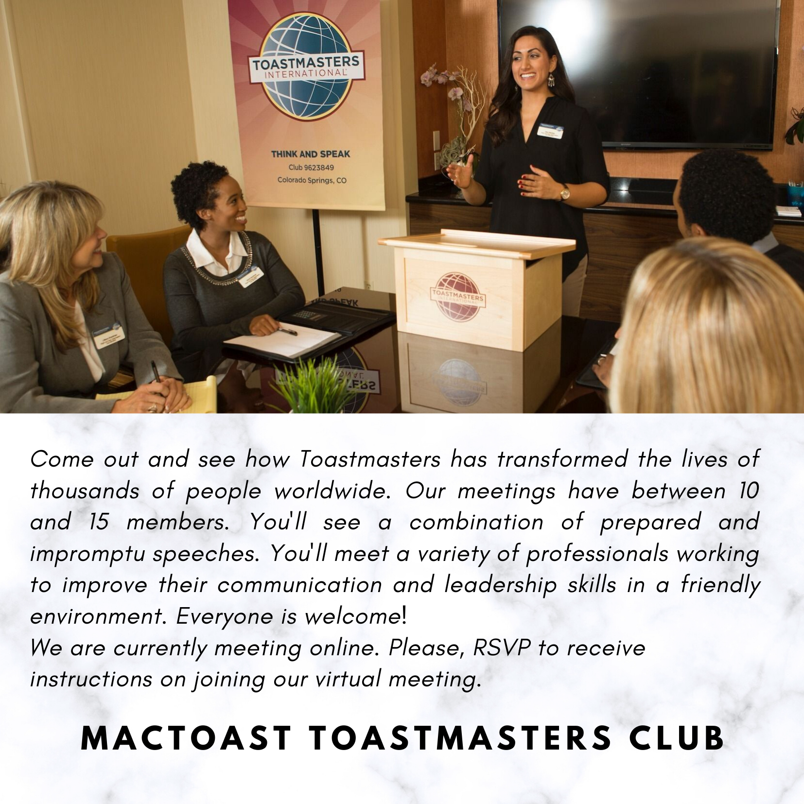

> “All our dreams can come true if we have the courage to pursue them.”– Walt Disney

Motivation is your der any hobbies. Having the motivation to do something can help you achieve your bsire to do something with your personal life, at work, in school, in sports, oig goals and dreams, whatever they may be. Knowing how to motivate yourself can help you accomplish anything you set your mind to.

I motivated myself to take up all the projects and complete the pathways. You know why?' my Toastmaster Mentor Rolanda, [MACTOAST](https://1274.toastmastersclubs.org/)  TOASTMASTERS, believes in me encourages me, and envisage me competing in all the upcoming competitions. So, do I. She is my motivation, her vision is my motivation.

I was at Level 4 Motivational strategy my first pathway/ project. It was all about a project that benefits the club with teamwork. Wow! That’s something which was on my To-do list. I immediately contacted my Vice President of Education Emerson Stewart for his valuable guidance.

The first key to motivation is to **surround yourself with motivated people**. Yes, I am. This was the most fascinating part. At the very beginning, the first team member I approached was my chat buddy, Marshe, to know how things work here in the US, and what were the mediums to reach people. She gave information about Eventbrite.com and how it works. Then I prepared a poster of two pages, we together reviewed it and shared with our club.

Two things happened; we received a strong motivating E-mail from my mentor Rolanda. The first line of her E-mail is always “thanks for all you do” such an amiable person acknowledging everyone’s participation.

Then to my bigger surprise, my team placed these posters on our club's [Facebook](https://www.facebook.com/MacToast) page acknowledging my work and effort, sharing their pervasive support.

The second key to motivation is to **celebrate small wins**. The next meeting, I did celebrate with my teammate Marshe, also celebrated with my hubby my all-time favorite buddy. That was a gala moment.

The next step was to take it to a larger group of people, Marshe and I did our part with no anomaly. I reached out to my second teammate Rachel, who was active in [LinkedIn](https://www.linkedin.com/in/indhu-chinnathambi-a0540861/), and she immediately supported me by sharing the post and reaching out to people.

So, I feel it was the entire team that supported me in this project, and this is the greatest teamwork ever. I also started getting a response from people from different parts of the world.

> “It’s hard to beat a person who never gives up.” – Babe Ruth

I’m not going to give up until I taste success. Everything you can imagine is real. You can make it real with dedication and persistence.

[MACTOAST](https://www.eventbrite.com/e/mactoast-toastmasters-club-meeting-tickets-114319927982) TOASTMASTERS contact me to join us. #Explore #Experiment #Experience

