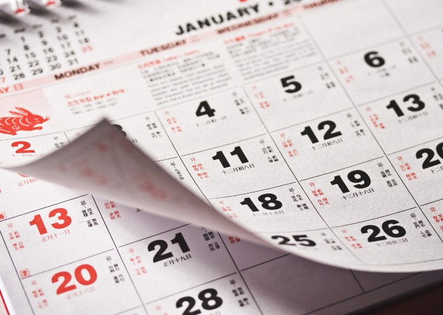
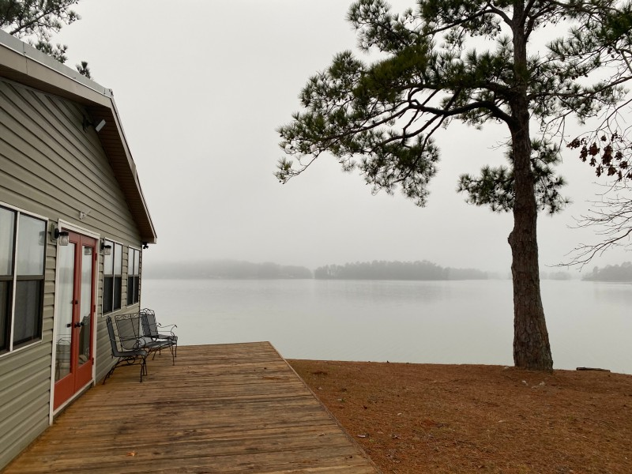
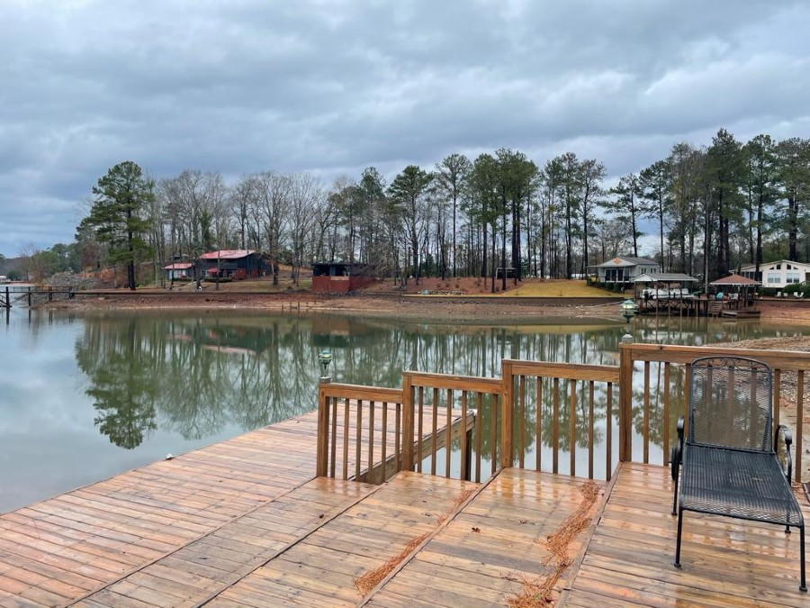

New Year's Day, also simply called New Year, is observed on the 1st of January, the first day of the year on the modern Gregorian calendar as well as the Julian calendar. In pre-Christian Rome under the Julian calendar, the day was dedicated to Janus, the god of gateways and beginnings, for whom January is also named. 

The new year on January 1st as we all know is based on the Gregorian, Julian, or the English calendar. We have different calendars followed all over the world which I have listed below.

- We have the European new year which the Serbian new year celebrated on January 14th and the middle eastern Hijri new year on March 21st.
- We have an African calendar based on ancient Egyptian legacy, different clans celebrate on different days few in June, few by august.
- We have east Asian which covers Chinese New Year based on Lunar calendar, Japanese, and Korean have solar and Lunar calendar.
- We have Southeast Asians like Cambodian, Thai on 13th or 14th April, and Vietnamese falls between January 20th to February 20th.
- We also have, south Asian, which is India and we almost have 8 to 10 different new year celebrated throughout the country. India is a country known for its diversity.

Though we have different calendars, different New Year celebrated all over the world, this new year on January 1st is the one celebration, happening in common people forget their difference and join to gather for the countdown and the fireworks at midnight, with lots of love and happiness wishing each other. It’s a nostalgic feel and that’s why New year is one of my favorites.

This new year for me was quite a different one, it was quiet comparatively.
We weren’t roaming on the streets watching fireworks and wishing random people instead we went to a lake house at Lake Martin in Alabama with our close friends, we had great homemade food varieties, fireworks, and cake. 

We Also had DJ night with a dance floor and music. I time I spent with the kids was a continued amusement. I felt more attention and love from my husband with no intervention of electronic gadgets like computers and mobile phones. Though it was a different way of a celebration than the previous year, it was a different flavor of celebrations I ever had. 

That’s when I understood, no virus can stop this quality in humans. To love and to be loved, the happiness in sharing love to each other.