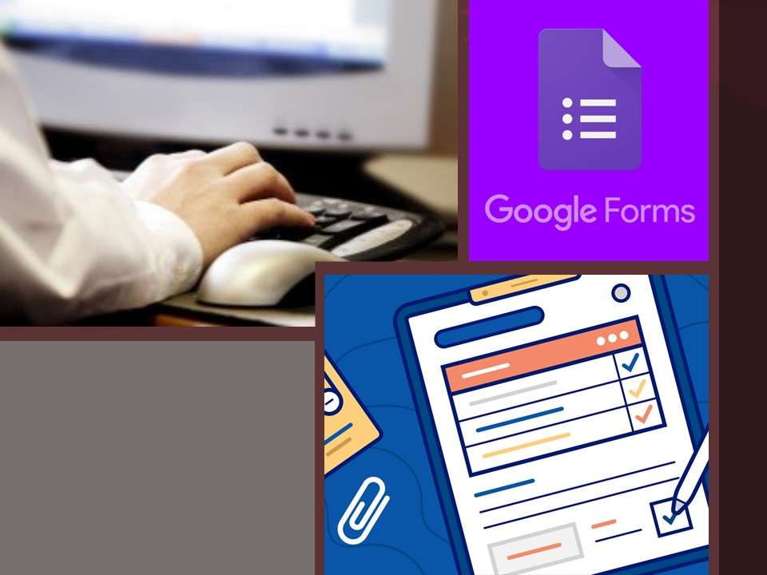

As a host there are lots of points to think, plan, organize and execute in an online event. Online or Open house either ways, requires lots of effort. I had an opportunity to organize an online event [‘What’s your Story?’](https://www.linkedin.com/posts/indhu-chinnathambi-a0540861_whats-your-story-activity-6719979706290184192-O_ir) and it was a success. During this process there were many steps that I did, few were first time attempt and few I was used to. Out of those steps today I'm going share a few and explain how it works for me.

The first thing was the Posters. Posters does a great work of spreading the message, inviting people, grabbing their attention to our event. This is my fav part. There are lots of online tools for poster designs and for free. If your confused out of all tools you can always do it in PowerPoint Presentation. This is what I do, I choose [Canva](https://www.canva.com/).

The next thing that we are going to focus is the documentation part. Documentation is particularly important for activities specifically for events like this. By documenting every single information, we are helping everyone involved in this process. Both the participants and the organizing team are equally benefited.

What is it and why is it so important? Let’s see the 5'S I got

- **Standard procedures and policies** 
What are the instructions we have, what is the event about, what is that we are doing, what should they do as a participant, thus the document communicates all the standard procedures and policies.

- **Separate Documents**
We have separate documents for every single activity like a separate document for the judges for their ballots count and the criteria's, documentation for instructions to be followed which was shared with all the participants, a separate document for the demo how to use the background, how to share the screen so such things may or may not be known to the participants. 
we added the demo, we had a separate document which was hyperlink to the main document. A separate document for every single action is important as it gives clarity and helps everyone involved to stay on the same page and have equal understanding.

- **Simplify the Documentation**
Now if you’re going to keep sharing pages and pages of MS word and PPTs fact is no one has the time for it. We got to keep it short and simple just the important points to be shared in a page or two. 

- **Share**
As I said earlier if we keep sharing docs in pages no one is going to like it. That too, not the document always. I mean you can still upload docs in linked but not with Facebook. When we are to market and share word about our event, we shall choose to do it interesting and innovative ways which is always welcomed. I choose to upload the doc to the cloud and simplify it to a hyperlink. With that I can save my doc and share the simplified link.

- **Subject Clarity**
Following all this I felt the team working together and the participants can have subject clarity.

Now we have done our part, the person viewing your post online wants to enroll as participant. 
The challenges we must face here:
- We should gather all information at one go
- Out of which we must decide the participants speaking order
- Share it with them and also with the team uniformly
Google forms helped me in all these challenges.

We must create a survey with all questions and share the hyperlink in the social media. As and when people update you get their information with which you can follow up.

Finally choose the platform out of all available tools like Zoom, Teams, Hangout, Go To Meeting. Practice and get prepared for all challenges in this technical world, I'ts a good initiative if we assign a tech master to manage technical part of the event and then, **Rock the Show!!**

