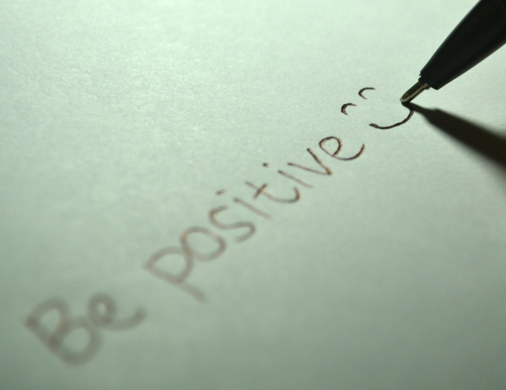

> "You’ve gotta dance like there's nobody watching;
Love like you'll never be hurt,
Sing like there's nobody listening
And live like its heaven on earth."
_ William W. Purkey

Living to this quote, I'm here to present a speech on title ‘Sometimes it’s okay to be crazy’ explaining who am I. 

One morning at 1990, an express train from Chennai to Bangalore started of slowly. That moment a lady in the train got her labor pain.  people somehow managed to get her down. She was taken to a nearby with her husband. she gave birth to a cute little naughty brat and that’s me.

As I was enjoying my childhood, I heard two strong statements. 1st from dad, “it's very tough to handle you”, 2nd from my mom, “I know you will never listen to others. Just remember to get back to me when your struck doing some mistake.”

That was sweet indeed. I just followed her words. When someone say don’t put your hand into fire, I purposely do that. once got hurt, I shout Mama!

There was an incident which made me realize my father's words were true. I was a baseball player and a hockey player. My sister was a basketball player. We used to practice even during weekends. One Saturday morning while we were practicing, I just threw the house key to my sister but it landed on the cycle & bike rack roof top. 

Practice got over and people left. Only then I came to know the mis landing of my key. Unfortunately, it was a holiday so I had no help. I had to do the adventure on my own. After a long struggle when I came to the real ground, I heard my sister saying, “I was about to reach home by 10AM, now it's 1PM. “It's really tough handling you”. She also got a separate key for herself, that same evening.

As my life went exploring, experimenting and learning there came a barrier. My condition was a nerve disorder affecting my limbs movement and sensing at the age of 15. I went back to the affirmative statement makers.

My dad said,” In Indian mythology Mahabharata, Lord Krishna plans to assassinate one member of the king's family just that he had supreme powers that the world cannot bear.” so just feel great about yourself.

My mom said,” every coin has two sides. Few things can't be controlled and can't be changed either. But definitely can be focused and channelized. 

True words, then onwards I stared feeling light, confident most importantly kept seeing the other side of the coin.

I didn’t stop sports until higher secondary. I was awarded the best outgoing student at school. Completed graduation and masters. Won several seminar programs. Started my career as a soft skill trainer and I always wanted to continue my passion hence I'm here at toastmasters.

To conclude, if you ever have a doubt on all situation seeing the positive side; yes, you can. Remember every coin has two sides, look for the positive one. Keeping yourself light and crazy. So, sometimes it's okay to be crazy.

