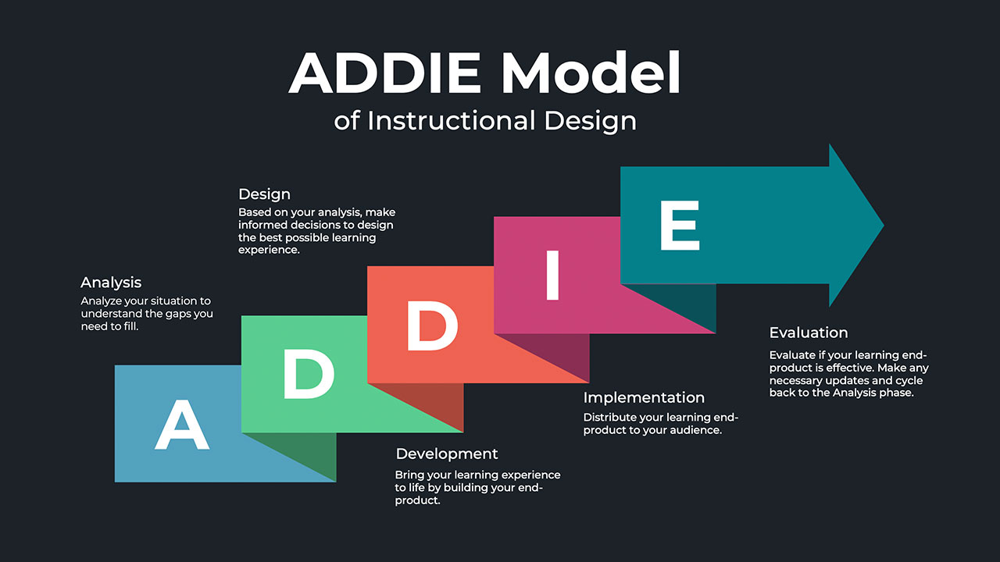

Have you ever experienced this?

The moment you receive your question paper in the exam hall, your eyes rush in search of specific questions
- Questions from a chapter 
- Questions about a specific concept which your very much fond of
- It would have been quite simple for you to comprehend; you would have been able to acknowledge it in a short period of time.
- You would have also volunteered to explain this concept 1000 times to your friends just because you felt so connected with this concept.

I had this experience several times and I would like to share one such concept which I consider the base process of my life. When I was pursuing my first certification in 2014 in learning and development ([Ripples Learning, Banglore](https://www.rippleslearning.com/)), the most interesting period determining my life; my career, that is when I came across this concept.
The Addie model is an instructional design methodology used to help organize and streamline the production of your course content. This model was developed in the 1970’s.

A – Analyze  
D – Design  
D – Develop  
I – Implement  
E – Evaluate  

### The Analysis Phase

This Phase we will be analyzing the learning problem. The key word here is ‘Identify’. The questions we generally ask to prepare a deep and precise Training need Analysis will be
- What is the actual learning gap and how does it affect or impacts the goals and objective?
- What is the need of the learner and is training the right solution?
- A statistical report on the level of the existing knowledge, the desired knowledge, and the impact of the variance.
- If the analysis reports the problem as a training need, then analyze your environment, constraints, and the delivery options we must decide upon the type of the training to be provided  

### The Design Phase

The Design Phase is used to design training materials and a blueprint. The key word here is ‘Specify’. We will be concentrating on designing
- The Learning Objectives
- Storyboards
- Prototypes
- User Interface
- Content

### The Development Phase

In this phase we will develop the training material based on the design that is approved or accepted. The key word here is ‘Produce’. We will be developing 
- Content
- Learning Materials

### The Implementation Phase

This phase is used to implement the training material that we designed and developed.

### The Evaluation Phase

This phase is used to evaluate the work done. Here we evaluate and assess 
- The content
- The training
- The trainer
- The learner/learners
- The criteria used
- We also gather learners’ feedback

Evaluation is of two types

- Formative – evaluation done focusing on continuous improvement for a specific period.
- Summative – criteria-based evaluation done based on the feedback gather for a specific training program.

This theory of Instructional design is an effective one, though its simple. I feel; not just learning environment, it can be used anywhere. Even in personal life, were ever you feel like having a systematic approach will help you gain a successful result.

