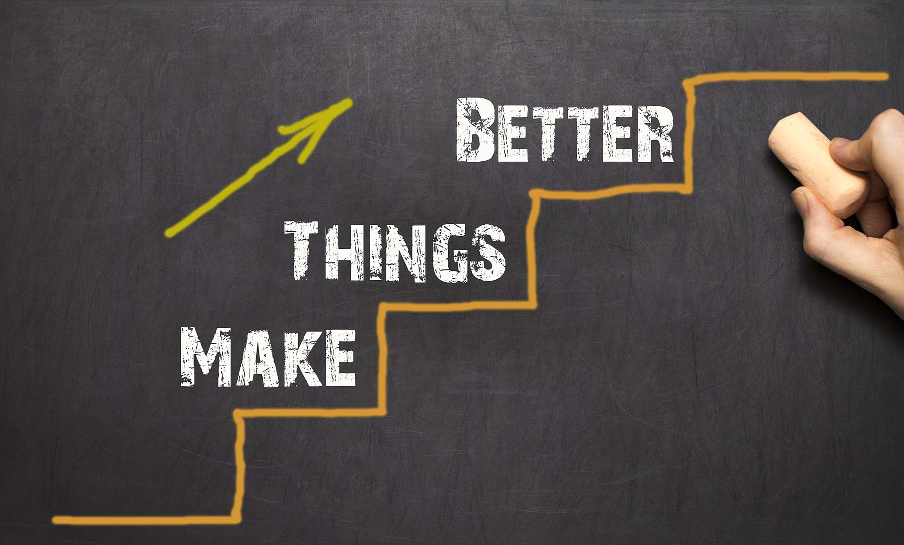

If you think this formula is about the fried chicken, we eat, NO. It isn’t. this formula, though looks mild, it is profound and far-reaching.

During this pandemic, we keep getting lots of information. Information we need and not need, information which makes you feel good and bad, Information that helps you and ceases you, information makes you active and dormant.

At the beginning of this pandemic, I had this somber feel seeing all the death rate and their sufferings. Later, I understood it’s a challenge that everyone is facing but in a different way. ‘Now it’s up to you, how you going to change this as an opportunity’, I said this to myself.

I started attending webinars, online sessions, started networking, and listening to other people’s stories. That’s when I came across this person. The moment he started his speech, I had no strong opinion, just a youngster giving his speech. As he started his story, I couldn’t stop my thoughts.

As a youngster, he faced 9 crises at the same time. 2 years of continuous medication and anti-depressants didn’t help much. He was going deeper and deeper into thoughts of guilt, shame, bleak, anxiousness, and finally disheartening.

With these overblown feelings, he took the decision of self-destruction, eventually saved by a friend. Though he survived, he needed something, that will prevent him from that dark pit called depression and help him to come out of the emotional distress.

After a long struggle, he finally came out with a formula.

He called this formula... **K.F.C**.

- **K** = KNOW where you are now
- **F** = FIND out where you want to be
- **C** = CHANGE, little-by-little, from where you are now, to where you want to be.

He also gave 5 steps which can reduce your stress and pacify you.

He said, “Find a time and Settle in a calm place. Execute these 5 steps.

- **STEP 1:** On a piece of paper, write down 1 word of all the things that are causing you distress. It can be financial, job, relationship, etc. List down as many as possible, but only 1 word for each category.

- **STEP 2:** Rate each category from 1 – 10, where 1 is currently least stressful and 10 is currently most stressful to you. These ratings express your present stress level about the categories.

- **STEP 3:** For each category, what would be your ‘desired’ rating? Perhaps your current is 9 and you’d like to bring it down to 4 to make it more tolerable and manageable. Be practical in your desired rating, it should be reasonable and attainable.

- **STEP 4:** Next, write down a list of things you can do, to bring your ‘current’ rating to your ‘desired’ rating. It’s important, this is a list of what YOU can do, and not what you want others to do.

- **STEP 5:** Put it away and don’t think about it. Let your mind rest; and the universe starts working its ‘magic’.
  How do these steps work?

Once you pen down all the possibilities after deep thinking, you have some clarity on what to do and which one to prioritize. Your mind will be able to process all the actionable steps and process them”.

He also said to repeat the exercise after 1 or 2 months. You may be pleasantly surprised that your stress ratings do come down and things start to get better.

I found this more intense and useful, also worth sharing.

For more motivation check out this facebook page [Motivated by Fear](https://www.facebook.com/111334147004922/posts/197922311679438/?extid=UgeyVMuaq3hkHVga&d=n)
