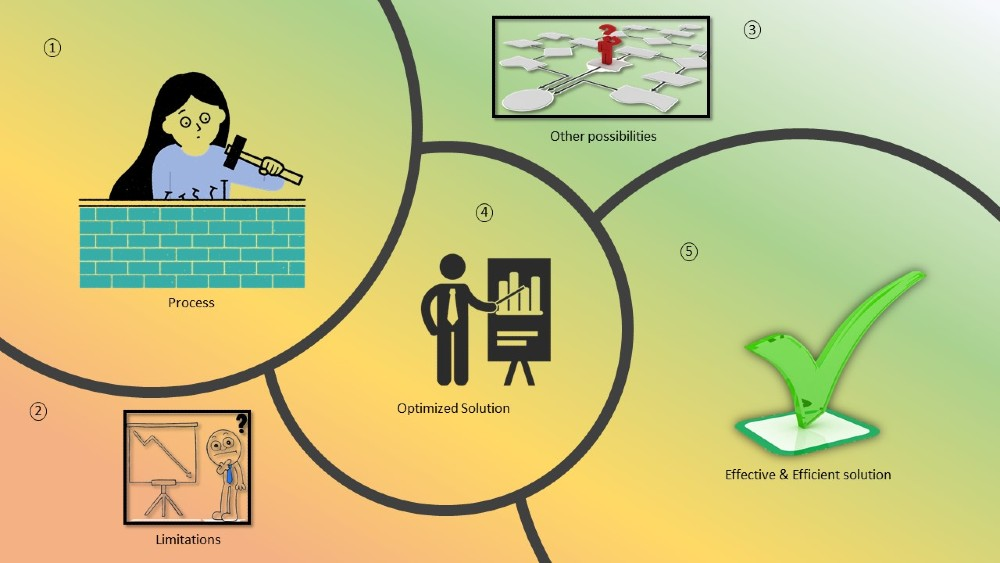
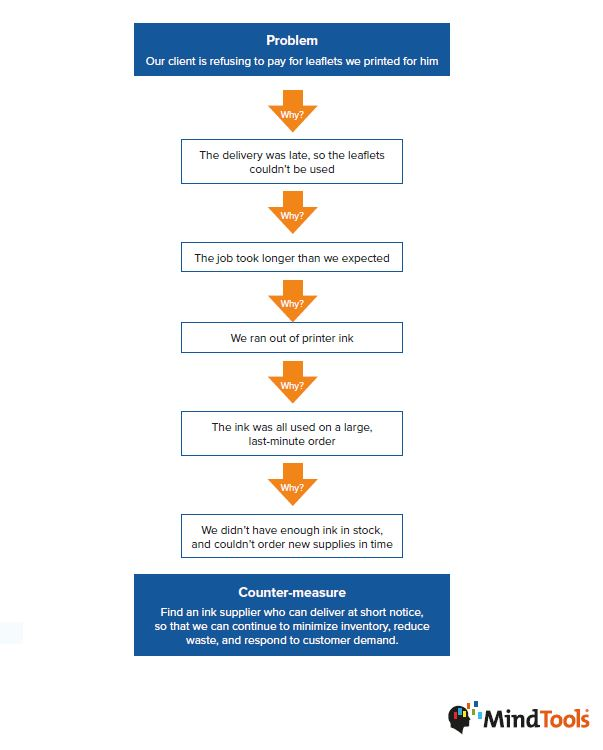

The question word ‘Why’, is it good or bad? It doesn’t matter.  
What matters is, whether it is useful or not?  
When you question ‘why’, you come out with discoveries.  
Only because someone asked ‘why is it like this?’, ‘why can’t it be like that?’ we had several discoveries and inventions, as a result, we are enjoying the comfy world.

Asking why on a processor or a procedure we get to know the boundaries or the limitations. That answers you, what’s possible and what’s not possible along with why it’s not possible.  
Also, it lets you think about the other possibilities for an optimized solution. In other words, the other way to get it done or optimize the actions to find effective and efficient solutions. It also answers other questions like, what to do? When to do? And how to do it?

In the action of analyzing ‘why’, I wanted to share an important tool, the ultimate Root Cause Analysis tool - 5 why analysis which can be applied both professional and personal life. A synopsis from [MidTools](https://www.mindtools.com/pages/article/newTMC_5W.htm)

You can use 5 Whys for troubleshooting, quality improvement, and problem-solving, but it is most effective when used to resolve simple or moderately difficult problems. The 5 Whys uses "counter-measures," rather than "solutions." 

A countermeasure is an action or set of actions that seek to prevent the problem from arising again, while a solution may just seek to deal with the symptom. As such, countermeasures are more robust, and will more likely prevent the problem from recurring.

Focusing on the relationship, questions like why she is short? Why is she tall?’ and why is he quiet all the time?... you wanted to know the answers?  
She is short because of her gene; she is tall probably because she is a sports player, and he is quiet because he chose to be an introvert. These are not ‘answers’, these are conditions.

**Behind every why; there is a condition.**  

I asked my therapist why isn’t my husband loving me the way I do?  
She said, “that’s him, and she continued, If you just believe that he loves you then it means he has his way or style of showing it. Every why has a condition.”  
Asking ‘why’ isn’t wrong unless you ask to find a solution and move on.

‘Why’ being good or bad, depends on two things.

 - What is the purpose of the question?
 - How are we going to use it?

Based on my experience, ‘Why’ is good if used appropriately.