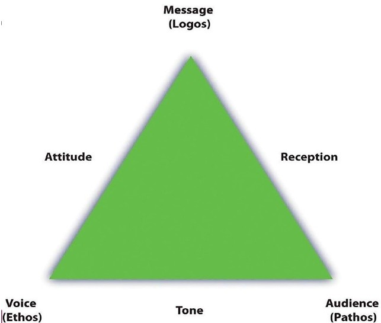

***YOU CANNOT NOT COMMUNICATE***

This is the principle fundamental Proponents of NLP. whatever you think, both Conscious and subconscious mind, you must communicate to convert it to actions by expressing by speaking. Effective communication is critical in any role.

Speaking effectively is defined as speaking in such a way that your message is clearly heard. The two main elements to speaking effectively:
- What you say, and 
- How you say it.

Let’s focus on one of the important processes of effective communication. **Persuasion** is the process of communication that is intended to induce belief or action. A salesperson is the best Example. I have always admired the way they Explain about their products or services to induce belief and make us purchase things.

A technique or a tool that’s used when persuading our audience is **The Rhetoric triangle**. ‘Rhetoric’ means a technique of how to use language effectively to please or persuade someone. Roman general Julius Caesar’s murder by his friend Brutus and his speech to the public explaining Caesar's death which completely turned the mindset of that public. Not just him, anyone who attempts to deliver a speech applying this tool it will be a success. 

It is an ancient art If you use it well, your audience will easily understand what you're saying, and will more likely be influenced by it.
The three points on the Rhetorical Triangle relate directly to the three classic appeals you should consider when communicating:
- Ethos: building trust by establishing your credibility and authority (Writer).
- Pathos: appealing to emotion by connecting with your audience through their values and interests (Audience).
- Logos: appealing to your audience's intelligence with well-constructed and clearly argued ideas (Context).

**Ethos (Credibility)**

As a speaker, you must clarify who you are, why you are competent to speak on the issue, and where your authority comes from. Whether you're presenting ideas for problem-solving, analysis, or just to entertain, your audience will try to figure out your motives, beliefs, values, and assumptions. This allows them to evaluate your credibility and decide whether you are being sincere.

**Pathos (Emotion)**

When you communicate, you need to understand your audience and appeal to their emotions. This is known as pathos. Be clear about why you are communicating with this audience in the first place, and plan out your communication style in advance, with the audience firmly in mind.
Think about the emotion you want to evoke. Are you addressing a pain point, seeking their trust, or inviting their loyalty?

**Logos (Context)**

Finally, your audience will analyze your message by putting it into context. Here the emphasis is on logic and reason, or logos. Your audience will analyze the kinds of arguments you used, their relevance, and whether you delivered them in a clear, coherent, and appropriate way. They'll be looking for a logical, well-constructed argument, and evidence for any claims that you make. They'll also be thinking about any possible counterarguments.

When you prepare a written document, speech, or presentation, consider the three elements of the triangle. This tool may increase the overall impact of your message.
change. 
