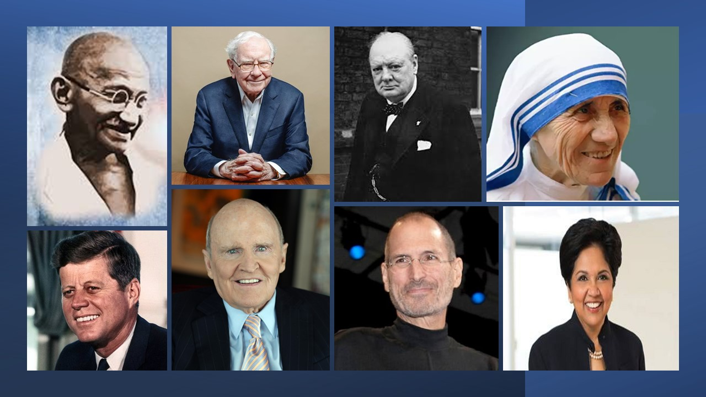
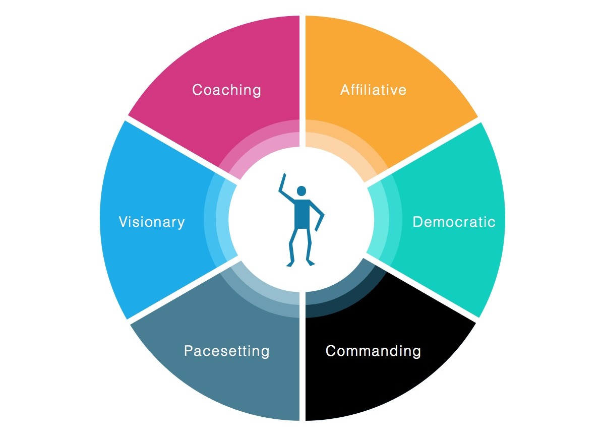

**Who is a leader?**

Leaders help themselves and others to do the right things. They set direction, build an inspiring vision, and create something new. Leadership is about mapping out where you need to go to "win" as a team or an organization; and it is dynamic, exciting, and inspiring. [Mindtools](https://www.mindtools.com/pages/article/newLDR_41.htm)

Every leader has their style of executing their leadership. Alright, have you guys analyzed your leadership styles. I’m going to talk about few leadership styles and their attributes. Let's together analyze our leadership styles and the advantage of incorporating other styles as well.

**Affiliative:** The famous finance guru Warren Buffet is the best example of this style. The strong focus on the team makes Mr. Buffet an affiliative leader. He involves them in the day-to-day operations, and he trusts his team. Affiliative leadership is also known as the People-first approach.

**Coaching:** One famous coaching leader comes to mind and that’s Mahatma Gandhi. He empowered a huge nation by getting the people motivated and believing in themselves. A leader who coaches views people as a reservoir of talent to be developed. The leader who uses a coach approach seeks to unlock people's potential. 

**Altruistic:** There are many examples of well-known altruistic leaders: Mother Theresa, the Dalai Lama, Eleanor Roosevelt, etc. Altruistic Leadership is defined as the guiding of others to improve their well-being or emotional state.

**Democratic:** Former CEO of PepsiCo, Indra Nooyi, demonstrated democratic leadership by showing how much she valued her team members by writing personalized letters to their parents. Democratic leadership is exactly what it sounds like, the leader makes decisions based on the input of each team member. Although he or she makes the final call, each employee has an equal say on a project's direction.

**Authoritative:** One of the many things that John F. Kennedy is remembered for is his vision concerning the United States' space program. authoritative leaders are experts in their field of work, and individuals that can clearly articulate a vision and the path to success. The phrase most indicative of this style of leadership is "Follow me."

**Innovative:** Classic examples of innovative leaders include people like Steve Jobs and Thomas Alva Edison. Innovation leadership is a philosophy and technique that combines different leadership styles to influence employees to produce creative ideas, products, and services.

**Bureaucratic:** Winston Churchill’s bureaucratic leadership still represents a good example of the method and, as the UK's Prime Minister during the Second World War. Bureaucratic leaders go by the books. This style of leadership might listen and consider the input of employees, unlike autocratic leadership, but the leader tends to reject an employee's input if it conflicts with company policy or past practices. 

**Pace Setting:** Jack Welch, the former CEO of General Electric, is an example of a successful pacesetter. As a leader, needed to focus more on setting examples and deadlines. Such a leader is obsessive about doing things faster and better. "Do as I do!" is the phrase most indicative of leaders who utilize the pacesetting style. This style describes a very driven leader who sets the pace as in racing. A leader with a pacesetting leadership style illustrates high standards for performance. 

The style which we prefer usually to execute our leadership will be our primary style or the predominant style. But we cannot rely on just one or few styles. We must be able to analyze and understand the benefits of the other styles as well. This will help us to switch our style based on situations and scenarios and to prove our leadership quality.

Finally, I would like to conclude by pointing out few attributes of a leader despite his or her choice of style.
- A leader must be an effective communicator
- He or she must lead by being an example
- He or she must be optimistic at all times
- Also, must be open-minded
- He or she must always demonstrate Integrity

