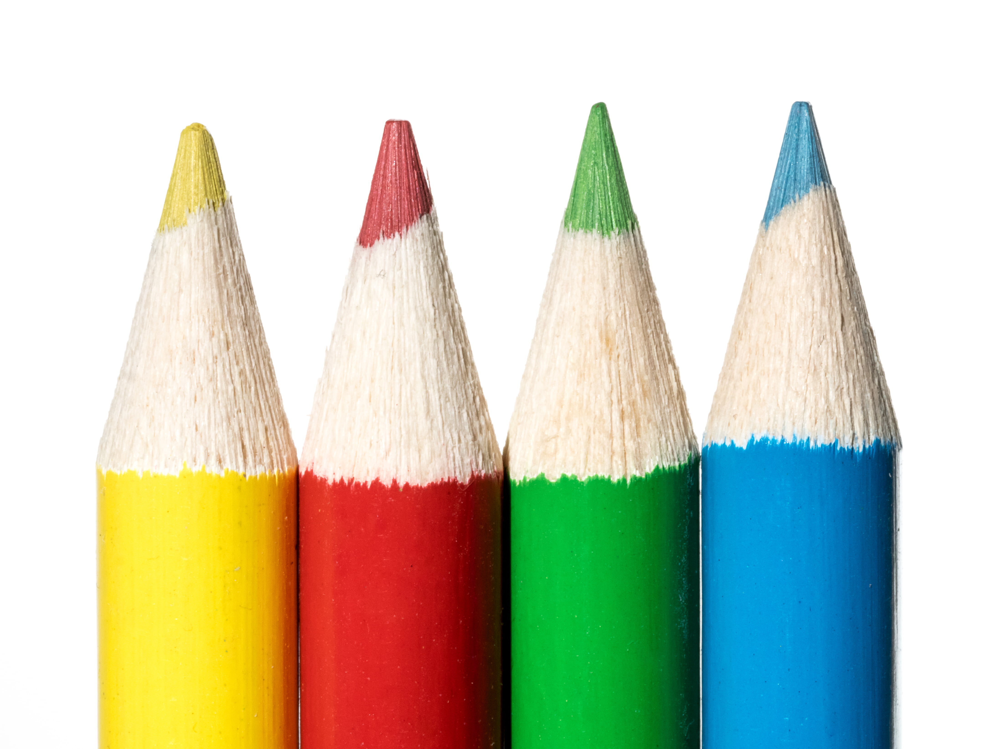
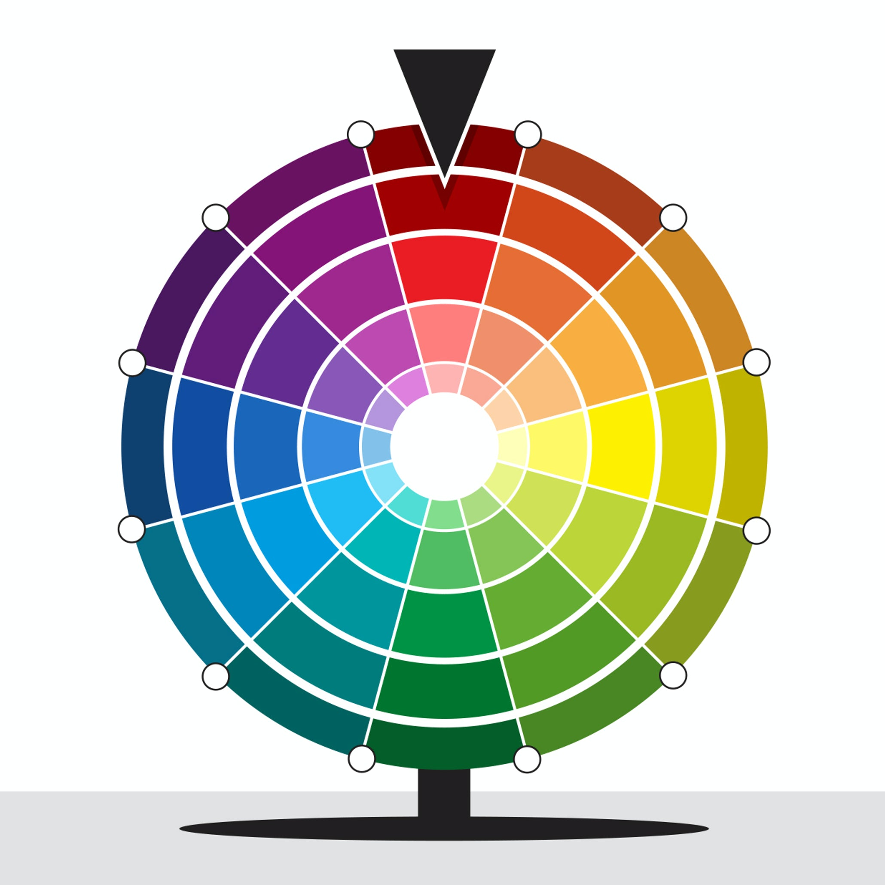
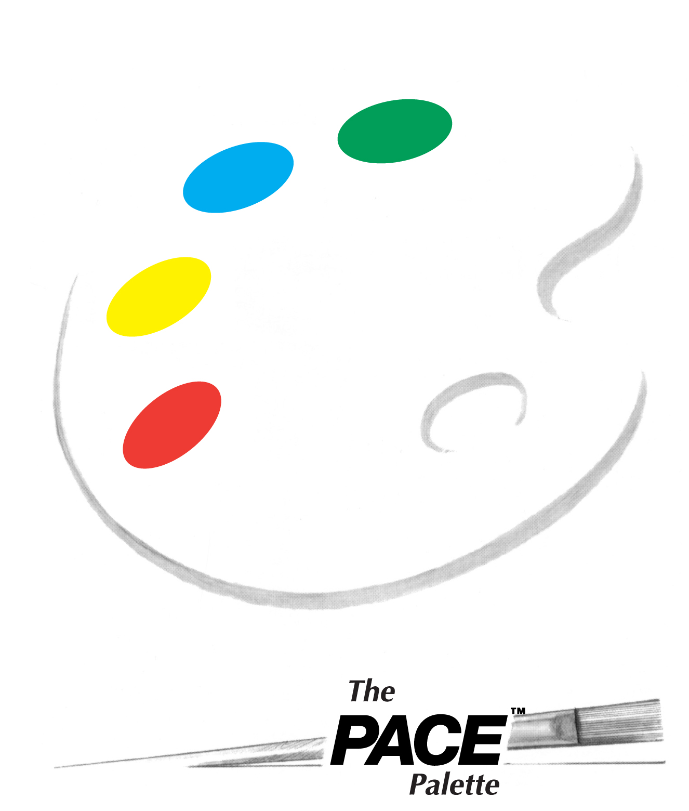

What is your favorite color and what it means to you?

Have you ever thought that your favorite color could reveal your personality?

The choice of colors while selecting a dress, wall paint, car, or a bike, even a mobile case. Everything can give a hint of your personality.

These are the four main colors and are called the primary colors. While mixing these colors in appropriate proportions, we can draw different colors called the secondary colors. So, any color choice other than the primary colors; it can direct you back to these primary colors.

Learning can happen anytime, anywhere, and about anything. This weekend had a virtual session conducted by the [LIFE academy](https://www.lifeacademy.co.in/). I learned about my favorite color and the relation with my personality. 

I have always been spontaneous in my actions; people may think that I am impulsive and impetuous. But for me, it's always relying on my intuitions and going on a flow.

I like to do things in my way and I also love to explore. Though I have a condition name peripheral neuropathy, which affects the functioning of my limbs, I got learners and learned driving. Give me a challenge and ill handle it now. I am bold, risk-taker, and competitive. Also, I love adventure.

Monotonous is something which I hate. In 7 years of experience, I have jumped seven companies, were I worked 3 long years with just only one place. All the other places were for 5 and 6 months. Because I didn't have a variety or excitement which is fun and stimulating for me.

Relationships are important to me. I feel a bond with people who care about me. If Tracy shows up to my club to support me, shows his guidance, and mentors me, I will respect him and remember him forever. I thrive on recognition and acceptance. I want to and I do have lots of friends. Name any place in India, if you’re traveling, let me know I'll make sure you'll have a great trip. Share and care are what I believe.

These are my personality traits. Are you interested in knowing your personality traits and their relation to your favorite color? Then don't hesitate, just ping me. 
Remember, personality traits are only the preference and choices of your temperament. It is not to profile someone.

I am Indhu Chinnathambi. My favorite colors are red and blue. I am a person who loves adventure and believes in harmony.

Source: [PACE palette](https://paceorg.com/about-pace/) personality testing tool

