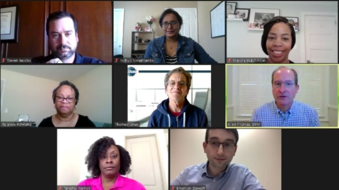

**What is your Leadership quality?**

November 29, 2019, Thanksgiving Day was when I first landed on this moon, the US. it was a noticeably big decision. I started working, i.e. learning, exploring, and experimenting at 16, which is quite common here but in India, with few families, girls can get educated and then get married. This was just a responsibility for the parents. If at all they work, it should be 30 mins away from home, hardly 5 miles.

I’m happy and proud that I was the first woman in my entire family to break that barrier. I’ve been so many ‘first’ in my family, things which not even guys in my family have done, naughty things included as well. Thanks to my parents for their trust, love, and support.

Such a personality must now quit her job, god knows when she will start working again. Got to wait with patience and belief. My hubby worried about the situation, but I said, “okay, I’ll do it”. When we use our skill, our knowledge and our experience, then yeah, we aren’t idle. With this perspective, I said to myself, dude, let’s focus on self-development.

Now let’s go back to November 29, 2019. Got settled in a cute little apartment. Two months passed by. I just wanted to do something but didn’t know what it is. My hubby then showed me the meet-up app and said search based on interest, go meet new people, I know that’s who you are. A lovely motivation and That’s how I landed here with [MacToast toastmasters](https://1274.toastmastersclubs.org/). January 2020, I started with fire by July 2020 I’ve completed 5 levels in my first path and 4 levels in my second path.

My aim was straight towards achieving DTM–Distinguished Toastmaster, after admiring Allen’s speech for the first time. DTM Allen Thomas, that’s how they introduced him in the club meeting. I waited for the best choice of elective to complete my 5th level to move forward towards my aim.

That’s when, at the right time, Rolanda and Emerson offered me the post of secretary. The inner me said, “dude, these are the points for you to accept, 
- You knew documentation and have experience 
- Grab the new opportunity when it knocks on your door 
- Learning and self-development are what you wanted 
- Finally, though your just 6 months old people trust you and ready to hand over some responsibility. It’s also love, isn’t it? Don’t miss it.” I said "yes".

It’s been 6 months now as secretary for MacToast toastmasters. My job was to record minutes of the meeting, share them with our club members. I think I have contributed more than just executing a job given. I have contributed and volunteered in several activities in our club meetings and other events. 

I still remember the first time I forgot to click our meeting picture and emailed nervously to my mentor, “I’m sorry I’ve missed it”, I’m sure she would have burst into laughter, seeing that email. At confused times like these, I always had Rolanda, my mentor and Emerson, Vice President of Education, MacToast Toastmasters guiding me throughout my leadership journey till now. My sincere thanks to you both. 

This is my first leadership journey with toastmasters, which built my confidence to accept the role of Vice President of Education for the [Cartersville Toastmasters club](https://cartersville.toastmastersclubs.org/). I just thought of these two people. Their pictures flashed in-front of my eyes. Oh! Yeah, they got my back, Chelo, let me do it and I said "yes".

Every leader carries few qualities that will help and motivate them in their leadership journey.
Every time I log in my system, I just keep thinking that I got to do something better, and that’s my leadership quality. And what is yours?

What’s your leadership quality?

